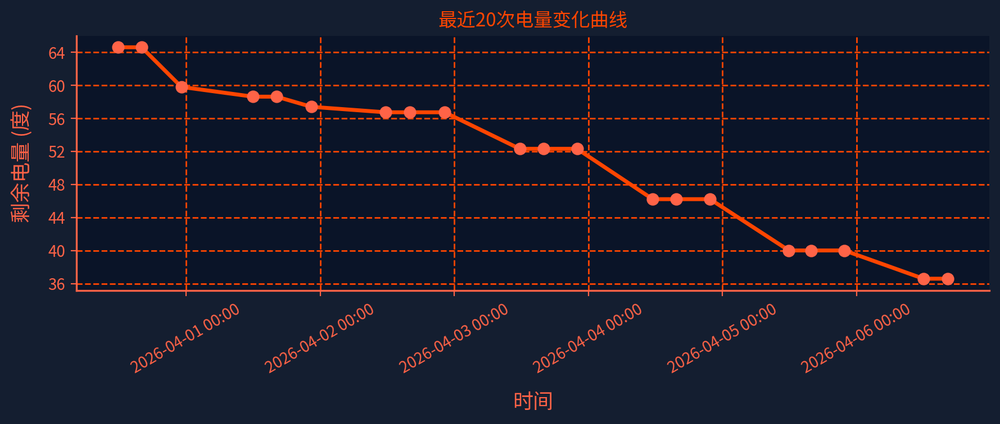
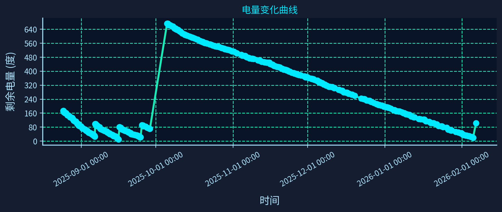

# 南京大学电费监控脚本

这是一个用于监控南京大学电费充值页面剩余电量的Python脚本，并提供可视化网页面板。

[](https://file+.vscode-resource.vscode-cdn.net/d%3A/Documents/Github/nju_electric_monitor/data/electricity_trend.png)

[](data/electricity_trend.png)

[点击查看电量数据表（CSV）](data/electricity_data.csv)

## 🌟功能特性

- 自动登录南京大学电费充值系统
- 自动识别验证码（使用 ddddocr OCR）
- 提取剩余电量信息
- 支持无头模式运行
- 数据保存为JSON和CSV格式
- 详细的日志记录
- **可视化网页面板，支持交互式电量曲线与数据表格**
- 一键批处理启动与网页自动打开

## 🤖Github Actions 自动运行

本项目已集成 Github Actions 自动定时监控与数据更新，无需本地部署即可自动采集和推送电量数据。

- 自动定时任务：每天多次自动运行，采集电量数据并推送到仓库。
- 自动安装依赖、中文字体、ChromeDriver、Tesseract OCR。
- 自动生成数据文件和可视化图片。
- 运行日志和数据自动提交到仓库。

**如何启用/配置自动运行：**

1. 在仓库设置 Secrets，添加 `NJU_USERNAME` 和 `NJU_PASSWORD`。
2. config_workflow.json中可以配置参数，`NJU_USERNAME` 和 `NJU_PASSWORD`不变即可
3. Actions 会自动拉取凭据并运行，无需手动操作。
4. 可在 Actions 页面查看运行日志和结果。

config_workflow.json部分参数：

- `captcha_retry_count`: 验证码识别重试次数（默认5次）
- `save_captcha_images`: 是否保存验证码图片用于调试（默认true）

## 🖥️本地运行方法

### 环境要求（本地运行）

- Python 3.9+（推荐 3.11，与 Github Actions 一致）
- Chrome浏览器
- ChromeDriver（已包含在chromedriver-win64目录中）

### 1. 安装依赖

```bash
pip install -r requirements.txt
```

### 2. 环境测试（推荐）

在运行主脚本之前，建议先运行环境测试：

```bash
python tests/test_environment.py
```

### 3. 解决PIL兼容性问题（重要）

如果遇到 `module 'PIL.Image' has no attribute 'ANTIALIAS'` 错误，请运行：

```bash
python src/fix_pil_compatibility.py
```

### 4. 准备ChromeDriver

确保项目根目录下有 `chromedriver-win64` 文件夹，并包含 `chromedriver.exe` 文件。

### 5. 配置脚本

首次运行时会自动创建 `config.json` 配置文件，或者手动创建：

- `captcha_retry_count`: 验证码识别重试次数（默认5次）
- `save_captcha_images`: 是否保存验证码图片用于调试（默认true）

```json
{
    "username": "你的用户名",
    "password": "你的密码",
    "auto_login": true,
    "headless_mode": true,
   "captcha_retry_count": 5,
   "save_captcha_images": true,
    "log_level": "INFO"
}
```

### 6. 运行主监控脚本

#### 方法1：使用批处理文件（推荐）

```bash
run_auto_monitor.bat
```

#### 方法2：直接运行Python脚本

```bash
python src/nju_electric_monitor_auto.py
```

或指定配置文件：

```bash
python src/nju_electric_monitor_auto.py config.json
```

### 7. 启动可视化网页面板

#### 推荐方式：一键批处理启动

```bash
run_web_panel.bat
```

- 会自动激活虚拟环境并启动网页服务
- 自动用Edge或Chrome浏览器打开 http://127.0.0.1:5000/
- 支持桌面快捷方式

#### 手动方式

```bash
python src/web_panel.py
```

然后浏览器访问 http://127.0.0.1:5000/

### 8. 调试与测试工具

- 页面结构调试：
  ```bash
  python tests/debug_page_structure.py
  ```
- 验证码识别测试：
  ```bash
  python tests/test_captcha_recognition.py
  ```

## 📄输出文件

- `data/electricity_data.json`：电量数据（JSON 行格式）
- `data/electricity_data.csv`：电量数据（CSV 格式，列为 time/num/unit）
- `data/electricity_trend.png`：完整历史电量变化曲线图
- `data/recent_20_changes.png`：最近 20 次电量变化曲线图（workflow/auto 版本）
- `data/debug_page_source.html`：页面源码（已对“持卡人姓名”等敏感信息做脱敏，仅用于调试）
- `data/captcha_debug.png`：最近一次验证码截图（用于快速查看验证码样式）
- `data/qr_pics_auto/*.png`：本地 auto 版本每轮重试保存的验证码图片，识别成功后会按识别结果重命名为 `PCET.png` 等
- `data/qr_pics_workflow/*.png`：GitHub Actions workflow 运行时每轮重试保存的验证码图片，识别成功后同样按识别结果重命名
- `logs/nju_electric_monitor-YYYY-MM-DD-HH.log`：主脚本按小时滚动生成的运行日志
- `logs/workflow_wrapper_*.log`：CI 包装脚本输出的完整运行日志（包含环境信息、字体诊断等）

## 🏁网页面板功能

- 实时展示电量变化曲线（可缩放、拖动、悬停查看数据）
- 数据表格美观展示，支持一键刷新
- 科技感UI设计，适配桌面与移动端

## 💡注意事项

1. 建议优先使用 Github Actions 自动运行，无需本地部署。
2. 本地运行时确保Chrome浏览器版本与ChromeDriver版本兼容。
3. 如果验证码识别失败，脚本会提示手动输入。
4. 建议在无头模式下运行以提高性能。
5. 请妥善保管登录凭据。
6. **重要**：如遇PIL兼容性问题，请运行 `src/fix_pil_compatibility.py`
7. 如果无法提取电量信息，请运行 `tests/debug_page_structure.py` 分析页面结构。
8. 如果验证码识别不正确，请运行 `tests/test_captcha_recognition.py` 测试识别效果。

## 🔐故障排除

### PIL兼容性问题（常见）

如果遇到 `module 'PIL.Image' has no attribute 'ANTIALIAS'` 错误：

1. **运行修复脚本**：

   ```bash
   python src/fix_pil_compatibility.py
   ```
2. **手动修复**：在脚本开头添加：

   ```python
   from pil_compatibility_patch import *
   ```
3. **降级Pillow版本**（如果修复脚本不起作用）：

   ```bash
   pip install Pillow==9.5.0
   ```

### 环境问题

如果遇到环境配置问题：

1. 运行 `python tests/test_environment.py` 检查环境配置
2. 确保所有依赖正确安装：`pip install -r requirements.txt`
3. 检查Python版本是否满足要求（建议 >= 3.9，推荐 3.11）

### ChromeDriver问题

如果遇到ChromeDriver相关错误，请检查：

1. `chromedriver-win64/chromedriver.exe` 文件是否存在
2. ChromeDriver版本是否与Chrome浏览器版本匹配
3. 文件权限是否正确

### OCR识别问题

如果验证码识别失败：

1. 检查网络连接
2. 确保 ddddocr 安装成功（`pip install -r requirements.txt` 会自动安装）
3. 尝试手动输入验证码
4. 运行 `python tests/test_captcha_recognition.py` 测试识别效果
5. 适当调大 `captcha_retry_count` 或查看 `data/qr_pics_auto` / `data/qr_pics_workflow` 中的验证码截图，人工比对识别结果

### 电量信息提取问题

如果无法提取电量信息：

1. 运行 `python tests/debug_page_structure.py` 分析页面结构
2. 查看生成的 `data/debug_page_source.html` 文件
3. 根据分析结果调整脚本中的选择器

### 验证码识别问题

如果验证码识别不正确：

1. 运行 `python tests/test_captcha_recognition.py` 测试不同的图像处理方法
2. 查看生成的调试图片，选择最清晰的处理方法
3. 适当调大 `captcha_retry_count`，或直接在本地通过手动输入验证码兜底

## 许可证

MIT License
